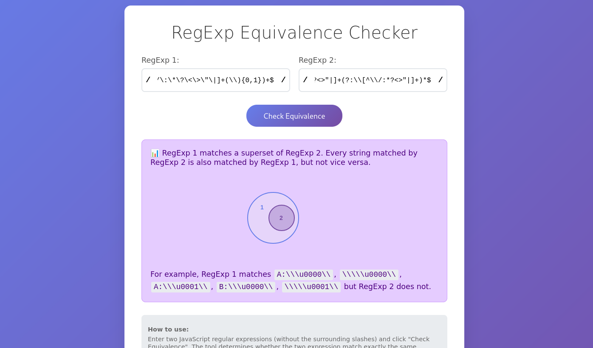

# Regex Utils 🔤

Zero-dependency TypeScript library for regex utilities that go beyond string matching.
These are surprisingly hard to come by for any programming language. ✨

- 📚 [Documentation](https://gruhn.github.io/regex-utils/interfaces/RegexBuilder.html)
- 🔍 [RegExp Equivalence Checker](https://gruhn.github.io/regex-utils/equiv-checker.html)

## API Overview 🚀

- 🔗 Set-like operations:
  - [.and(...)](https://gruhn.github.io/regex-utils/interfaces/RegexBuilder.html#and) - Compute intersection of two regex.
  - [.not()](https://gruhn.github.io/regex-utils/interfaces/RegexBuilder.html#not) - Compute the complement of a regex.
  - [.without(...)](https://gruhn.github.io/regex-utils/interfaces/RegexBuilder.html#without) - Compute the difference of two regex.
- ✅ Set-like predicates:
  - [.isEquivalent(...)](https://gruhn.github.io/regex-utils/interfaces/RegexBuilder.html#isEquivalent) - Check whether two regex match the same strings.
  - [.isSubsetOf(...)](https://gruhn.github.io/regex-utils/interfaces/RegexBuilder.html#isSubsetOf)
  - [.isSupersetOf(...)](https://gruhn.github.io/regex-utils/interfaces/RegexBuilder.html#isSupersetOf)
  - [.isDisjointFrom(...)](https://gruhn.github.io/regex-utils/interfaces/RegexBuilder.html#isDisjointFrom)
- 🔧 Miscellaneous:
  - [.sample(...)](https://gruhn.github.io/regex-utils/interfaces/RegexBuilder.html#sample) - Generate random strings matching a regex.
  - [.enumerate()](https://gruhn.github.io/regex-utils/interfaces/RegexBuilder.html#enumerate) - Exhaustively enumerate strings matching a regex.
  - [.size()](https://gruhn.github.io/regex-utils/interfaces/RegexBuilder.html#size) - Count the number of strings that a regex matches.
  - [.derivative(...)](https://gruhn.github.io/regex-utils/interfaces/RegexBuilder.html#derivative) - Compute a Brzozowski derivative of a regex.

## Installation 📦

```bash
npm install @gruhn/regex-utils
```
```typescript
import { RB } from '@gruhn/regex-utils'
```

## Example Use Cases 💡

### Refactor Regex and Check Equivalence 🔄

Say we identified a regex in the code base that is prone to
[catastrophic backtracking](https://stackoverflow.com/questions/45463148/fixing-catastrophic-backtracking-in-regular-expression)
and came up with a new version:

```typescript
const oldRegex = /^(?:[a-zA-Z]\:\\|\\\\)([^\\\/\:\*\?\<\>\"\|]+(\\){0,1})+$/
const newRegex = /^(?:[a-zA-Z]:\\|\\\\)([^\\\/\:*?<>"|]+\\?)+$/
```

Using `.isEquivalent` we can verify that the refactored version matches exactly the same strings as the old version.
That is, whether `oldRegex.test(str) === newRegex.test(str)` for every possible input string:

```typescript
RB(oldRegex).isEquivalent(newRegex) // true
```

There is also a [web interface](https://gruhn.github.io/regex-utils/equiv-checker.html) for checking regex equivalence
which also shows counterexample strings if the two regular expressions are not equivalent.
The source code is a single HTML file: [./equiv-checker.html](./equiv-checker.html).

<a href="https://gruhn.github.io/regex-utils/equiv-checker.html">
  
</a>

### Comment Regex using Complement 💬

How do you write a regex that matches HTML comments like:
```
<!-- This is a comment -->
```
A straight forward attempt would be:
```typescript
<!--.*-->
```
The problem is that `.*` also matches the end marker `-->`, 
so this is also a match:
```typescript
<!-- This is a comment --> and this shouldn't be part of it -->
```
We need to specify that the inner part can be any string that does not contain `-->`.
With `.not()` (aka. regex complement) this is easy:

```typescript
import { RB } from '@gruhn/regex-utils'

const strContainingCommentEnd = RB(/.*-->.*/)

const commentRegex = RB('<!--')
  .concat(strContainingEndMarker.not())
  .concat('-->')
```

With `.toRegExp()` we can convert back to a native JavaScript regex:
```typescript
commentRegex.toRegExp()
```
```
/^(<!-{2}(-{2}-*[^->]|-?[^-])*-{2}-*>)$/
```

### Password Regex using Intersections 🔐

It's difficult to write a single regex for multiple independent constraints.
For example, to specify a valid password.
But with regex intersections it's very natural:

```typescript
import { RB } from '@gruhn/regex-utils'

const passwordRegex = RB(/^[a-zA-Z0-9]{12,32}$/) // 12-32 alphanumeric characters
  .and(/[0-9]/) // at least one number
  .and(/[A-Z]/) // at least one upper case letter   
  .and(/[a-z]/) // at least one lower case letter
```

We can convert this back to a native JavaScript RegExp with:
```typescript
passwordRegex.toRegExp()
```
> [!NOTE]  
> The output `RegExp` can be very large.

We can also use other utilities like `.size()` to determine how many potential passwords match this regex:
```typescript
console.log(passwordRegex.size())
```
```
2301586451429392354821768871006991487961066695735482449920n
```

With `.enumerate()` we can list some of these matches:
```typescript
for (const sample of passwordRegex.enumerate().take(10)) {
  console.log(sample)
}
```
```
aaaaaaaaaaA0
aaaaaaaaaa0A
aaaaaaaaaAA0
aaaaaaaaaA00
aaaaaaaaaaA1
aaaaaaaaa00A
baaaaaaaaaA0
AAAAAAAAAA0a
aaaaaaaaaAA1
aaaaaaaaaa0B
```


### Solve _Advent Of Code 2023 - Day 12_ 🎄

In the coding puzzle [Advent Of Code 2023 - Day 12](https://adventofcode.com/2023/day/12)
you are given pairs of string patterns.
An example pair is `.??..??...?##.` and `1,1,3`.
Both patterns describe a class of strings and the task is to count the number of strings that match both patterns.

In the first pattern, `.` and `#` stand for the literal characters "dot" and "hash".
The `?` stands for either `.` or `#`.
This can be written as a regular expression:

 - for `#` we simply write `#`
 - for `.` we write `o` (since `.` has a special meaning in regular expressions)
 - for `?` we write `(o|#)`

So the pattern `.??..??...?##.` would be written as:
```typescript
const firstRegex = /^o(o|#)(o|#)oo(o|#)(o|#)ooo(o|#)##o$/
```

In the second pattern, each digit stands for a sequence of `#` separated by at least one `o`.
This can also be written as a regular expression:

 - For a digit like `3` we write `#{3}`.
 - Between digits we write `o+`.
 - Additionally, arbitrary many `o` are allowed at the start and end,
   so we add `o*` at the start and end.
   
Thus, `1,1,3` would be written as:
```typescript
const secondRegex = /^o*#{1}o+#{1}o+#{3}o*$/
```

To solve the task and find the number of strings that match both regex,
we can use `.and(...)` and `.size()` from `regex-utils`.
`.and(...)` computes the intersection of two regular expressions.
That is, it creates a new regex which exactly matches the strings matched by both input regex.
```typescript
const intersection = RB(firstRegex).and(secondRegex)
```
With `.size()` we can then determine the number of matched strings:
```typescript
console.log(intersection.size())
```
```
4n
```

While at it, we can also try `.enumerate()` to list all these matches:
```typescript
for (const str of intersection.enumerate()) {
  console.log(str)
}
```
```
oo#ooo#ooo###o
o#oooo#ooo###o
oo#oo#oooo###o
o#ooo#oooo###o
```

For a full solution checkout: [./benchmark/aoc2023-day12.ts](./benchmark/aoc2023-day12.ts).

## References 📖

Heavily informed by these papers:
- https://www.khoury.northeastern.edu/home/turon/re-deriv.pdf
- https://courses.grainger.illinois.edu/cs374/fa2017/extra_notes/01_nfa_to_reg.pdf
